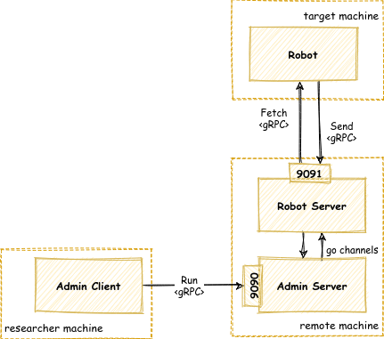

# RAR - Remote Access Robot

In this experiment we allow a client to execute OS commands in a target machine
via a remote server.



## Run

Start the server

```bash
$ go run cmd/server/server.go
```

Start the robot

```bash
$ go run cmd/robot/robot.go 
```

Execute commands using the client

```bash
$ go run cmd/client/client.go 'ls'
cmd
go.mod
go.sum
grpcapi
pkg
rar-diagram.png
README.md

$ go run cmd/client/client.go 'mkdir hello-rar'

$ go run cmd/client/client.go 'ls' | grep hello
hello-rar
```

## Making changes to the gRPC API

### Install `protoc` and `protoc-gen-go`

```bash
curl -LO https://github.com/protocolbuffers/protobuf/releases/download/v3.12.1/protoc-3.12.1-linux-x86_64.zip
unzip protoc-3.12.1-linux-x86_64.zip -d $HOME/.local
export PATH="$PATH:$HOME/.local/bin"

go get github.com/golang/protobuf/protoc-gen-go
export PATH="$PATH:$(go env GOPATH)/bin"
```

### Generate the Go code from protobuf


```bash
cd grpcapi/protobuf
protoc -I . robot.proto --go_out=plugins=grpc:../
```
____

The code you see here is based on the book [Black Hat Go](https://www.amazon.com/Black-Hat-Go-Programming-Pentesters/dp/1593278659).